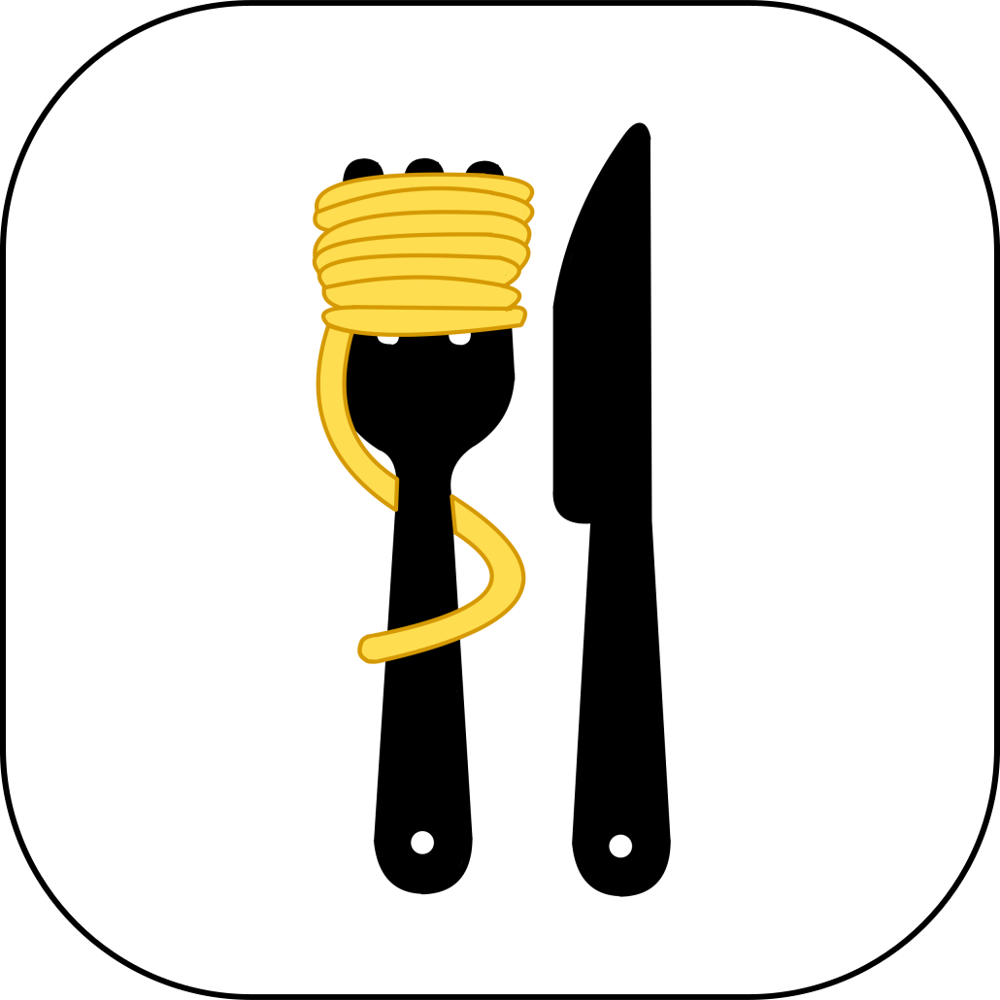
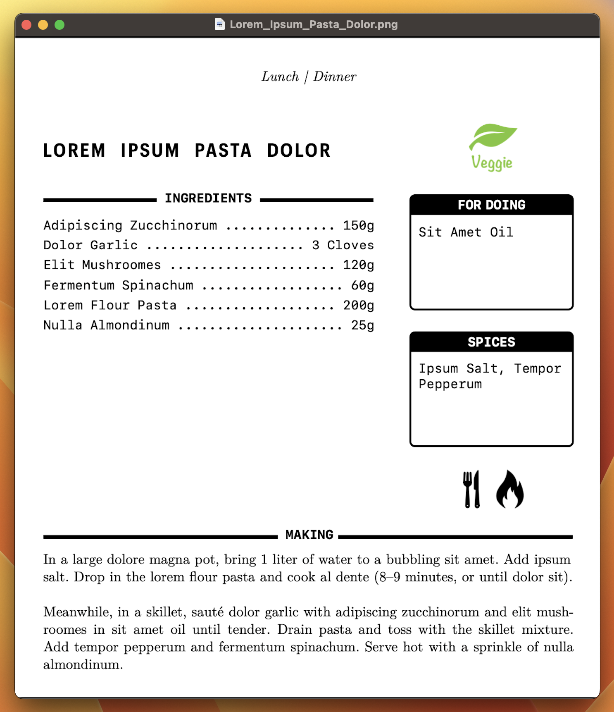

<div align="center">
  <br><br>

  **Rezeptig** is a simple LaTeX template for your recipe book.

  [](https://github.com/simonsuska/rezeptig/releases)
  []()
  [](https://github.com/simonsuska/rezeptig/blob/main/LICENSE)
</div>

---

## 🔎 Table of Contents

- [🎯 About](#about)
- [🚀 Getting Started](#getting_started)
- [💫 Usage](#usage)
- [⚖️ License](#license)

<div id="about"/>

## 🎯 About

Rezeptig makes it easy to save new recipes. Just fill in the placeholders and 
voila, you're done. 😁

The following preview shows an excerpt of the layout of a 
single recipe. The recipe book uses Din A4.



<div id="getting_started"/>

## 🚀 Getting Started

#### Prerequisites

- XeLaTeX (TeX Live 2023)
- Git
- Your favorite IDE

The template itself has no additional requirements. Convenience features require 
the `make` utility and other Unix commands, which may not be available on 
Windows or other non-Unix-like operating systems.

Please note that this template uses the fonts "Graphik Compact" and "SF Mono." 
If these aren't available on your system, you can change them at 
`recipebook.tex:20-21`.

### Unix-like Systems

```
git clone https://github.com/simonsuska/rezeptig.git
cd Rezeptig
git checkout main
make
```

### Non-Unix-like Systems

Check the [docs](DOCS.md) to see what is needed to build the template manually.

<div id="usage"/>

## 💫 Usage

Add new recipes with `make new`. Optionally, the file name can be specified 
using the `name` argument, The file name should be identical to the title of the 
recipe.

```
make new [name=awesome_recipe]
```

The recipe book can then be built with `make`. Optionally, the name of the 
target `build` can be specified.

```
make [build]
```

Before another build, the files created from the previous build must be 
cleaned up.

```
make clean
```

A detailed explanation of how Rezeptig works can be found in the 
[docs](DOCS.md).

<div id="license"/>

## ⚖️ License

Rezeptig is released under the MIT license. See [LICENSE](LICENSE) for details.
